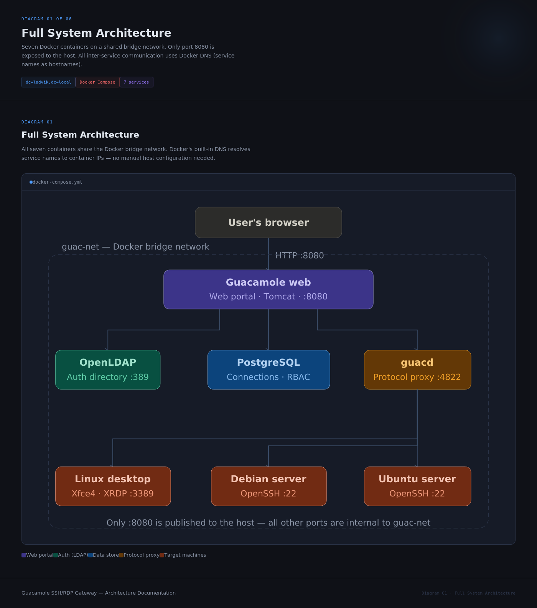
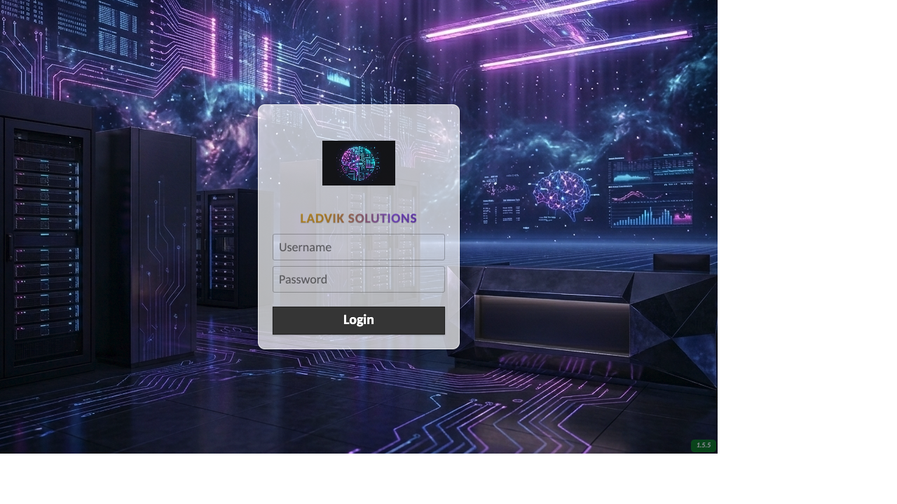
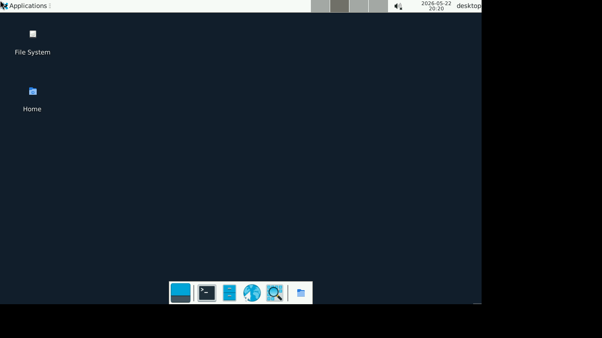
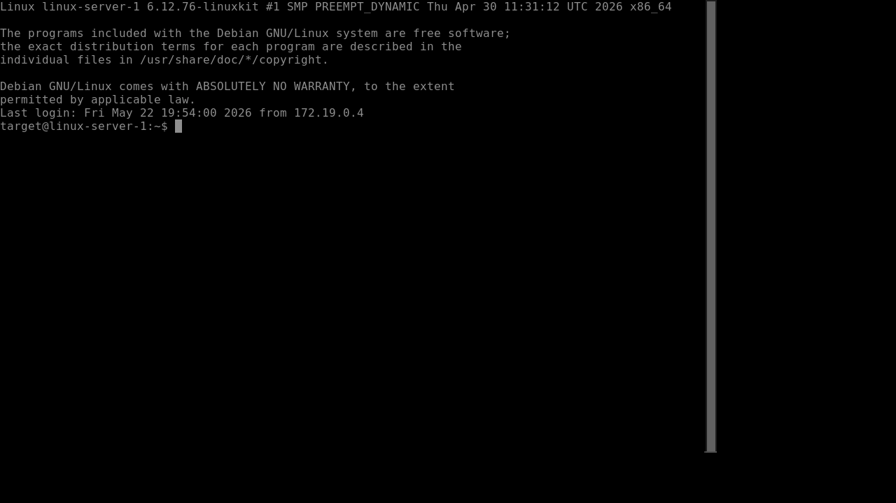
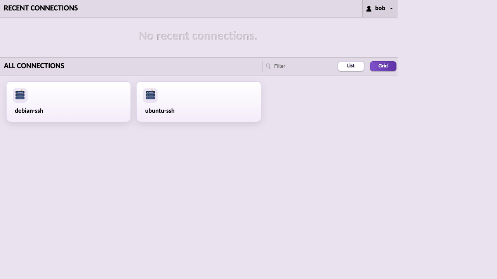
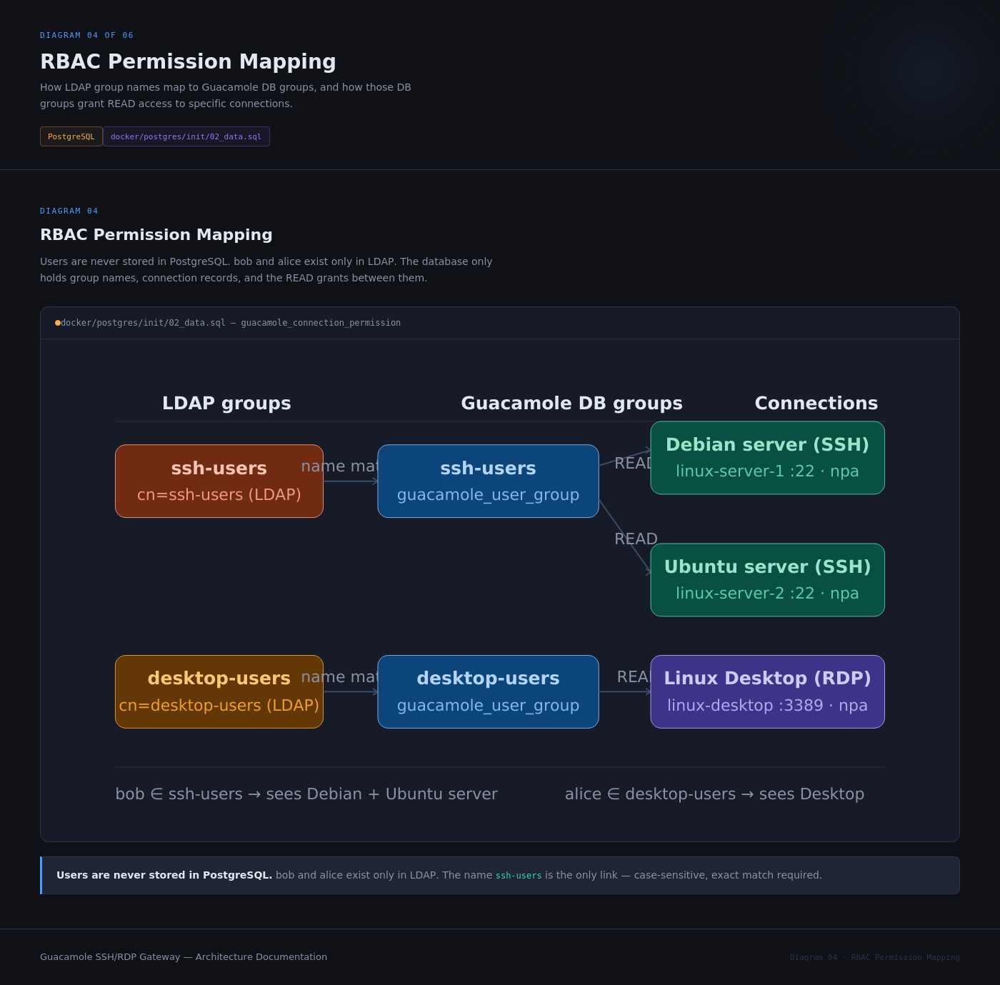
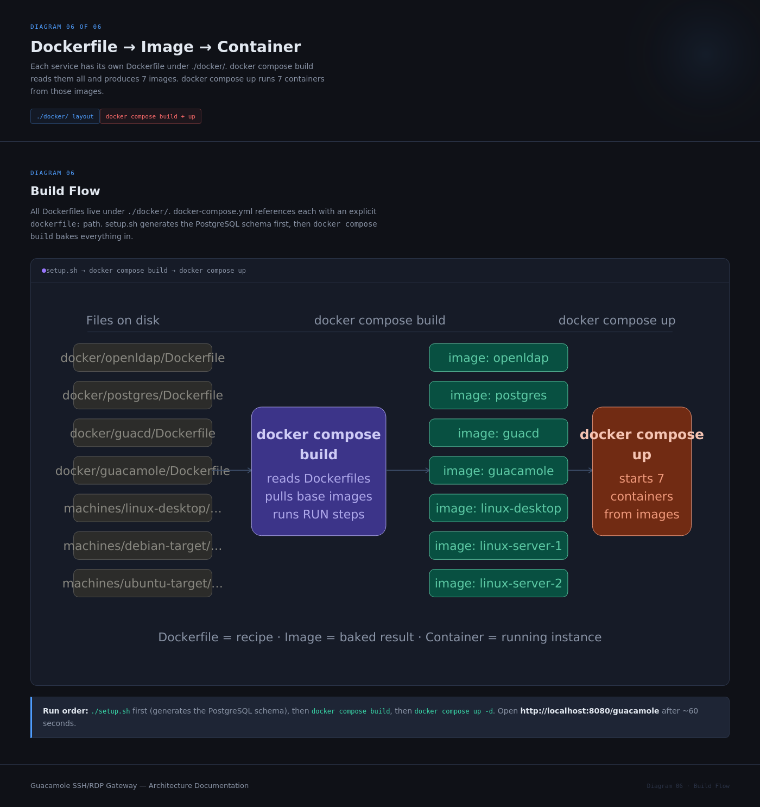

# 🖥️ Guacamole LDAP SSH/RDP Gateway

A fully containerised, browser-based remote-access gateway that lets you connect to SSH and RDP targets through a single web page — no client software needed. Users authenticate via LDAP so you manage credentials in one place, and every session is brokered by Apache Guacamole running inside Docker.

## 📋 What This Project Does

- Hosts **Apache Guacamole** so you can reach any Linux/Windows machine from any browser
- Authenticates users through **OpenLDAP** — add a user once, they can access every permitted target
- Stores connection profiles and audit history in **PostgreSQL**
- Ships three ready-to-use target machines (one RDP desktop, two SSH servers) so you can try everything straight away
- The whole stack starts with a single `docker compose` command

## 🏗️ Architecture



## 📁 Project Structure

```
guacamole-ldap-ssh-rdp-gateway/
├── docker-compose.postgres.openldap.yml   # Full stack definition
├── setup-postgres.sh                      # One-time schema bootstrapper
├── LICENSE
├── README.md
├── docker/
│   ├── openldap/
│   │   ├── Dockerfile                     # OpenLDAP (Ubuntu 22.04 + slapd)
│   │   ├── entrypoint.sh                  # Auto-initialises LDAP tree on first start
│   │   ├── groups.ldif                    # SSH users / Desktop users groups
│   │   └── slapd.conf                     # slapd configuration
│   ├── postgres/
│   │   ├── Dockerfile                     # PostgreSQL 15
│   │   └── init/
│   │       ├── data.sql                   # Seed data: connections, users, RBAC
│   │       └── schema_file.sql            # Generated Guacamole schema (setup-postgres.sh)
│   ├── guacd/
│   │   └── Dockerfile                     # guacd 1.5.5 daemon
│   ├── guacamole/
│   │   ├── Dockerfile                     # Guacamole 1.5.5 web app + branding extension
│   │   └── branding/                      # Custom branding extension (built into JAR)
│   │       ├── guac-manifest.json         # Extension manifest (namespace: ladvik-branding-v2)
│   │       ├── custom.css                 # Login/home UI overrides, grid/list view styles
│   │       ├── custom.js                  # List/Grid toggle injected into connections header
│   │       ├── images/
│   │       │   ├── ladviksolution_background.png  # Login page background
│   │       │   ├── ladviksolution_loginlogo.png   # Login card logo + header logo
│   │       │   ├── ladviksolutions_logo.png       # Brand logo
│   │       │   ├── server-ssh.svg                 # SSH connection card icon
│   │       │   └── server-rdp.svg                 # RDP connection card icon
│   │       └── translations/
│   │           └── en.json               # App name / title overrides
│   └── machines/
│       ├── linux-desktop/                # Ubuntu 24.04 + XFCE + XRDP
│       │   ├── Dockerfile
│       │   └── start.sh
│       ├── debian-target/                # Debian 12 + OpenSSH
│       │   ├── Dockerfile
│       │   ├── sshd_config
│       │   └── start.sh
│       └── ubuntu-target/                # Ubuntu 22.04 + OpenSSH
│           ├── Dockerfile
│           ├── sshd_config
│           └── start.sh
├── docs/
│   └── images/
│       └── diagram-01-architecture.png   # Full system architecture diagram
└── old/                                  # Legacy compose files (archived, not used)
    ├── docker-compose.yml
    ├── docker-compose.osixia.yml
    ├── docker-compose.postgres.yml
    ├── docker/ldap/
    └── ldap/bootstrap/
```

## 🔑 Credentials at a Glance

| What | Username | Password |
|------|----------|----------|
| **Guacamole login** | `bob` | `Bob@123` |
| **Guacamole login** | `alice` | `Alice@123` |
| **LDAP admin** | `cn=admin,dc=ladvik,dc=local` | `admin123` |
| **linux-desktop** (RDP) | `desktop` | `Desktop@123` |
| **linux-server-1/2** (SSH) | `target` | `Target@123` |
| **PostgreSQL** | `guacamole_user` | `guacamole_pass` |

> **LDAP groups**: `bob` is in **SSH users**; `alice` is in **Desktop users**

## 🚀 Getting Started

### Prerequisites

- **Docker Desktop** (or Docker Engine + Compose plugin) — [get it here](https://docs.docker.com/get-docker/)
- Ports **8080** free on your machine (Guacamole web UI)
- ~3 GB disk space for all images

Verify Docker is running:
```bash
docker info
```

---

### Step 1 — Generate the PostgreSQL Schema (once only)

Guacamole ships its own database schema inside the Docker image. This script pulls that image and extracts the SQL file into `docker/postgres/init/`:

```bash
./setup-postgres.sh
```

You only need to do this **once**. If you ever delete `docker/postgres/init/schema_file.sql`, run it again.

**Expected output:**
```
======================================================
  Guacamole Gateway — One-time Setup
======================================================

[1/2] Pulling guacamole/guacamole:1.5.5...
[2/2] Generating PostgreSQL schema from Guacamole image...
      Written: docker/postgres/init/schema_file.sql (1234 lines)

======================================================
  Setup complete! Next steps:
  1. docker compose -f docker-compose.postgres.openldap.yml up -d --build
  2. Open http://localhost:8080/guacamole
  ...
```

---

### Step 2 — Build and Start the Stack

```bash
docker compose -f docker-compose.postgres.openldap.yml up -d --build
```

This builds all 7 custom images and starts all containers. The first build takes a few minutes; subsequent starts are fast.

**Watch the containers come up:**
```bash
docker compose -f docker-compose.postgres.openldap.yml ps
```

All services should reach **healthy / running** state within ~30 seconds:

```
NAME             STATUS
guac-postgres    Up (healthy)
ldap             Up (healthy)
guacd            Up (healthy)
guacamole        Up
linux-desktop    Up
linux-server-1   Up
linux-server-2   Up
```

---

### Step 3 — Open Guacamole

Navigate to **[http://localhost:8080/guacamole/](http://localhost:8080/guacamole/)**

Log in with one of the LDAP accounts:

| User | Password | Can access |
|------|----------|------------|
| `bob` | `Bob@123` | `debian-ssh`, `ubuntu-ssh` |
| `alice` | `Alice@123` | `linux-desktop-rdp` |



---

## 🖥️ Using the Gateway

### Connecting to the Linux Desktop (RDP)

1. Log in as **alice** (`Alice@123`)
2. Click the **linux-desktop** connection tile
3. An XFCE desktop session opens directly in your browser

Inside the RDP session, the local user is `desktop` / `Desktop@123`.



---

### Connecting to a Linux Server (SSH)

1. Log in as **bob** (`Bob@123`)
2. Click **debian-ssh** or **ubuntu-ssh**
3. A terminal opens in your browser — no SSH client needed

Inside the SSH session, the local user is `target` / `Target@123`.



---

### Guacamole Home Dashboard

After login you'll see your permitted connections listed:



---

## 👤 LDAP User Management

Users and groups are automatically created when the `ldap` container first starts. The initialisation is **idempotent** — restarting the stack never wipes existing data.

### Default users

| UID | Full name | Password | Group |
|-----|-----------|----------|-------|
| `bob` | Bob | `Bob@123` | SSH users |
| `alice` | Alice | `Alice@123` | Desktop users |

### Verifying the LDAP tree

```bash
docker exec ldap ldapsearch -x \
  -H ldap://localhost:389 \
  -D "cn=admin,dc=ladvik,dc=local" -w admin123 \
  -b "dc=ladvik,dc=local"
```

### Testing a user bind (authentication check)

```bash
docker exec ldap ldapwhoami -x \
  -D "uid=bob,ou=users,dc=ladvik,dc=local" -w "Bob@123"
# Expected: dn:uid=bob,ou=users,dc=ladvik,dc=local
```

### Adding a new user

Create a file `newuser.ldif`:
```ldif
dn: uid=carol,ou=users,dc=ladvik,dc=local
objectClass: inetOrgPerson
objectClass: posixAccount
uid: carol
cn: Carol
sn: Carol
userPassword: Carol@123
loginShell: /bin/bash
uidNumber: 1003
gidNumber: 501
homeDirectory: /home/carol
mail: carol@ladvik.local
```

Apply it:
```bash
docker exec -i ldap ldapadd \
  -x -D "cn=admin,dc=ladvik,dc=local" -w admin123 \
  < newuser.ldif
```

### RBAC Permission Mapping



---

## 🔧 Configuration

All tuneable values are environment variables inside `docker-compose.postgres.openldap.yml`.

| Variable | Default | Description |
|----------|---------|-------------|
| `GUACAMOLE_PORT` | `8080` | Host port for Guacamole web UI |
| `POSTGRES_DB` | `guacamole_db` | PostgreSQL database name |
| `POSTGRES_USER` | `guacamole_user` | PostgreSQL username |
| `POSTGRES_PASSWORD` | `guacamole_pass` | PostgreSQL password |
| `GUACAMOLE_VERSION` | `1.5.5` | Guacamole / guacd image version |

Override any default at runtime:
```bash
GUACAMOLE_PORT=9090 docker compose -f docker-compose.postgres.openldap.yml up -d
```

---

## 🛑 Stopping the Stack

```bash
# Stop all containers (data volumes preserved)
docker compose -f docker-compose.postgres.openldap.yml down

# Stop AND wipe all data (fresh start)
docker compose -f docker-compose.postgres.openldap.yml down -v
```

---

## 🐛 Troubleshooting

**Guacamole shows "Invalid login"**
- Make sure the `ldap` container is **healthy**: `docker compose -f docker-compose.postgres.openldap.yml ps`
- Verify the LDAP tree has users: `docker exec ldap ldapsearch -x -H ldap://localhost:389 -D "cn=admin,dc=ladvik,dc=local" -w admin123 -b "ou=users,dc=ladvik,dc=local"`
- Check Guacamole logs: `docker logs guacamole --tail 50`

**`setup-postgres.sh` fails with "schema_file.sql missing"**
- Run `./setup-postgres.sh` before `docker compose up --build`
- Make sure Docker is running: `docker info`

**Port 8080 already in use**
- Change the host port: `GUACAMOLE_PORT=9090 docker compose ... up -d`

**LDAP container exits immediately**
- Check logs: `docker logs ldap`
- Delete the data volume for a clean reset: `docker volume rm guacamole-ldap-ssh-rdp-gateway_openldap_data`

**RDP session blank / black screen**
- Wait 5–10 seconds and refresh the Guacamole tab — XRDP takes a moment to start the desktop session

**"Connection refused" on linux-server-1 or linux-server-2**
- Verify the container is running: `docker ps | grep linux-server`
- SSH starts on port 22 internally; Guacamole connects to it directly — no host port exposure needed

---

## 📊 Container Overview

| Container | Image base | Exposed to host | Role |
|-----------|-----------|-----------------|------|
| `guacamole` | `guacamole/guacamole:1.5.5` | **:8080** | Web UI |
| `guacd` | `guacamole/guacd:1.5.5` | — | Protocol daemon |
| `ldap` | `ubuntu:22.04` + slapd | — | LDAP directory |
| `guac-postgres` | `postgres:15` | — | Config & audit DB |
| `linux-desktop` | `ubuntu:24.04` + XFCE + XRDP | — | RDP target |
| `linux-server-1` | `debian:12` + OpenSSH | — | SSH target (Debian) |
| `linux-server-2` | `ubuntu:22.04` + OpenSSH | — | SSH target (Ubuntu) |

### Build Flow



---

## 📚 Resources

- [Apache Guacamole Documentation](https://guacamole.apache.org/doc/gug/)
- [Guacamole Docker Guide](https://guacamole.apache.org/doc/gug/guacamole-docker.html)
- [OpenLDAP Documentation](https://www.openldap.org/doc/)
- [LDAP Data Interchange Format (LDIF)](https://www.openldap.org/doc/admin24/ldif.html)

---

## 📝 License

This project is licensed under the terms of the [LICENSE](LICENSE) file.

---

## 🌐 Connect With Me

🏠 [Portfolio](https://ladviksolutions.netlify.app/)<br>
🐙 [GitHub](https://github.com/premkumar-palanichamy)<br>
💼 [LinkedIn](https://linkedin.com/in/premkumarpalanichamy)<br>
▶️ [YouTube](https://www.youtube.com/channel/UCJKEn6HeAxRNirDMBwFfi3w)
